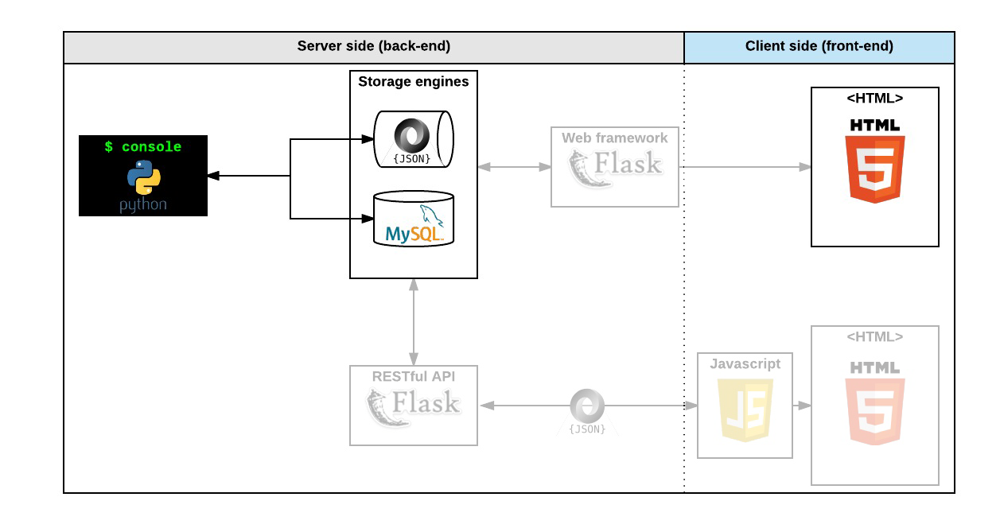

<div align="center">
<br>


</div>


<p align="center">


</p>


<h1 align="center"> AirBnB clone - MySQL </h1>


<h3 align="center">
<a href="https://github.com/RazikaBengana/holbertonschool-AirBnB_clone_v2#eye-about">About</a> •
<a href="https://github.com/RazikaBengana/holbertonschool-AirBnB_clone_v2#hammer_and_wrench-tasks">Tasks</a> •
<a href="https://github.com/RazikaBengana/holbertonschool-AirBnB_clone_v2#memo-learning-objectives">Learning Objectives</a> •
<a href="https://github.com/RazikaBengana/holbertonschool-AirBnB_clone_v2#computer-requirements">Requirements</a> •
<a href="https://github.com/RazikaBengana/holbertonschool-AirBnB_clone_v2#keyboard-more-info">More Info</a> •
<a href="https://github.com/RazikaBengana/holbertonschool-AirBnB_clone_v2#mag_right-resources">Resources</a> •
<a href="https://github.com/RazikaBengana/holbertonschool-AirBnB_clone_v2#bust_in_silhouette-authors">Authors</a> •
<a href="https://github.com/RazikaBengana/holbertonschool-AirBnB_clone_v2#octocat-license">License</a>
</h3>

---

<!-- ------------------------------------------------------------------------------------------------- -->

<br>
<br>

## :eye: About

<br>

<div align="center">

**`AirBnB clone - MySQL`** project is the second version of a four-part progressive implementation, focusing on integrating a `MySQL` database and developing a robust data model for the application.
<br>
<br>
The programs implement an Object-Relational Mapping (`ORM`) system using `SQLAlchemy`, defining models for various entities like `users`, `places`, `cities`, and `amenities`, with the ability to switch between file-based storage and database storage.
<br>
This version emphasizes **backend data management** and **storage**, laying the groundwork for more advanced features in future iterations of the AirBnB clone project.
<br>
<br>
This project has been created by **[Holberton School](https://www.holbertonschool.com/about-holberton)** to enable every student to understand how to build a fully functional web application.
<br>
<br>
Through hands-on development of core components, we gain practical experience in backend systems, data modeling, software architecture, and front-end web development skills.

</div>

<br>
<br>

### Background Context

<br>

Environment variables will be your best friend for this project!

<br>

- `HBNB_ENV`: running environment. It can be “dev” or “test” for the moment (“production” soon!)

- `HBNB_MYSQL_USER`: the username of your MySQL 

- `HBNB_MYSQL_PWD`: the password of your MySQL

- `HBNB_MYSQL_HOST`: the hostname of your MySQL

- `HBNB_MYSQL_DB`: the database name of your MySQL

- `HBNB_TYPE_STORAGE`: the type of storage used. It can be “file” (using `FileStorage`) or `db` (using `DBStorage`)

<br>
<br>

<!-- ------------------------------------------------------------------------------------------------- -->

## :hammer_and_wrench: Tasks

<br>

**`0. Fork me if you can!`**

**`1. Bug free!`**

**`2. Console improvements`**

**`3. MySQL setup development`**

**`4. MySQL setup test`**

**`5. Delete object`**

**`6. DBStorage - States and Cities`**

**`7. DBStorage - User`**

**`8. DBStorage - Place`**

**`9. DBStorage - Review`**

**`10. DBStorage - Amenity... and BOOM!`**

<br>
<br>

<!-- ------------------------------------------------------------------------------------------------- -->

## :memo: Learning objectives

<br>

**_You are expected to be able to [explain to anyone](https://fs.blog/feynman-learning-technique/), without the help of Google:_**

<br>

```diff

General

+ What is Unit testing and how to implement it in a large project

+ What is *args and how to use it

+ What is **kwargs and how to use it

+ How to handle named arguments in a function

+ How to create a MySQL database

+ How to create a MySQL user and grant it privileges

+ What ORM means

+ How to map a Python Class to a MySQL table

+ How to handle 2 different storage engines with the same codebase

+ How to use environment variables

```

<br>
<br>

<!-- ------------------------------------------------------------------------------------------------- -->

## :computer: Requirements

<br>

```diff

Python Scripts

+ Allowed editors: vi, vim, emacs

+ All your files will be interpreted/compiled on Ubuntu 20.04 LTS using python3 (version 3.8.5)

+ All your files should end with a new line

+ The first line of all your files should be exactly #!/usr/bin/python3

+ A README.md file, at the root of the folder of the project, is mandatory

+ Your code should use the pycodestyle (version 2.7.*)

+ All your files must be executable

+ The length of your files will be tested using wc

+ All your modules should have documentation (python3 -c 'print(__import__("my_module").__doc__)')

+ All your classes should have documentation (python3 -c 'print(__import__("my_module").MyClass.__doc__)')

+ All your functions (inside and outside a class) should have documentation (python3 -c 'print(__import__("my_module").my_function.__doc__)' and python3 -c 'print(__import__("my_module").MyClass.my_function.__doc__)')

+ A documentation is not a simple word, it’s a real sentence explaining what’s the purpose of the module, class or method (the length of it will be verified)


Python Unit Tests

+ Allowed editors: vi, vim, emacs

+ All your files should end with a new line

+ All your test files should be inside a folder tests

+ You have to use the unittest module

+ All your test files should be python files (extension: .py)

+ All your test files and folders should start by test_

+ Your file organization in the tests folder should be the same as your project: ex: for models/base_model.py, unit tests must be in: tests/test_models/test_base_model.py

+ All your tests should be executed by using this command: python3 -m unittest discover tests

+ You can also test file by file by using this command: python3 -m unittest tests/test_models/test_base_model.py

+ All your modules should have documentation (python3 -c 'print(__import__("my_module").__doc__)')

+ All your classes should have documentation (python3 -c 'print(__import__("my_module").MyClass.__doc__)')

+ All your functions (inside and outside a class) should have documentation (python3 -c 'print(__import__("my_module").my_function.__doc__)' and python3 -c 'print(__import__("my_module").MyClass.my_function.__doc__)')

+ We strongly encourage you to work together on test cases, so that you don’t miss any edge cases


SQL Scripts

+ Allowed editors: vi, vim, emacs

+ All your files will be executed on Ubuntu 20.04 LTS using MySQL 8.0

+ Your files will be executed with SQLAlchemy version 1.4.x

+ All your files should end with a new line

+ All your SQL queries should have a comment just before (i.e. syntax above)

+ All your files should start by a comment describing the task

+ All SQL keywords should be in uppercase (SELECT, WHERE…)

+ A README.md file, at the root of the folder of the project, is mandatory

+ The length of your files will be tested using wc

```

<br>

**_Why all your files should end with a new line? See [HERE](https://unix.stackexchange.com/questions/18743/whats-the-point-in-adding-a-new-line-to-the-end-of-a-file/18789)_**

<br>
<br>

### GitHub

<br>

There should be one project repository per group. <br>
If you clone/fork/whatever a project repository with the same name before the second deadline, you risk a 0% score.

<br>
<br>

<!-- ------------------------------------------------------------------------------------------------- -->

## :keyboard: More Info

<br>
<br>



<br>
<br>

### `HBNB` - Storage abstraction:

<br>
<br>

[](https://www.youtube.com/watch?v=fb2zxES7ROU)

<br>
<br>

### Comments for your `SQL` file:

<br>

```yaml
$ cat my_script.sql
-- first 3 students in the Batch ID=3
-- because Batch 3 is the best!
SELECT id, name FROM students WHERE batch_id = 3 ORDER BY created_at DESC LIMIT 3;
$
```

<br>
<br>

<!-- ------------------------------------------------------------------------------------------------- -->

## :mag_right: Resources

<br>

**_Do you need some help?_**

<br>

**Concepts:**

* [Python packages](https://drive.google.com/file/d/11Ulf37AP0nCX9hzfeym068HoFuHKLggh/view?usp=sharing)

<br>

**Read or watch:**

* [cmd module](https://docs.python.org/3/library/cmd.html)

* [unittest module](https://docs.python.org/3/library/unittest.html#module-unittest)

* [args/kwargs](https://yasoob.me/2013/08/04/args-and-kwargs-in-python-explained/)

* [SQLAlchemy tutorial](https://docs.sqlalchemy.org/en/13/orm/tutorial.html)

* [How To Create a New User and Grant Permissions in MySQL](https://www.digitalocean.com/community/tutorials/how-to-create-a-new-user-and-grant-permissions-in-mysql)

* [Python3 and environment variables](https://docs.python.org/3/library/os.html?highlight=env#os.getenv)

* [SQLAlchemy](https://docs.sqlalchemy.org/en/13/)

* [MySQL 8.0 SQL Statement Syntax](https://dev.mysql.com/doc/refman/8.0/en/sql-statements.html)

* [AirBnB clone - ORM](https://www.youtube.com/watch?v=jeJwRB33YNg&feature=youtu.be)

<br>
<br>

<!-- ------------------------------------------------------------------------------------------------- -->

## :bust_in_silhouette: Authors

<br>

**${\color{blue}Razika \space Bengana}$**

<br>
<br>

<!-- ------------------------------------------------------------------------------------------------- -->

## :octocat: License

<br>

```AirBnB clone - MySQL``` _project has no license specified._

<br>
<br>

---

<p align="center"><br>2022</p>